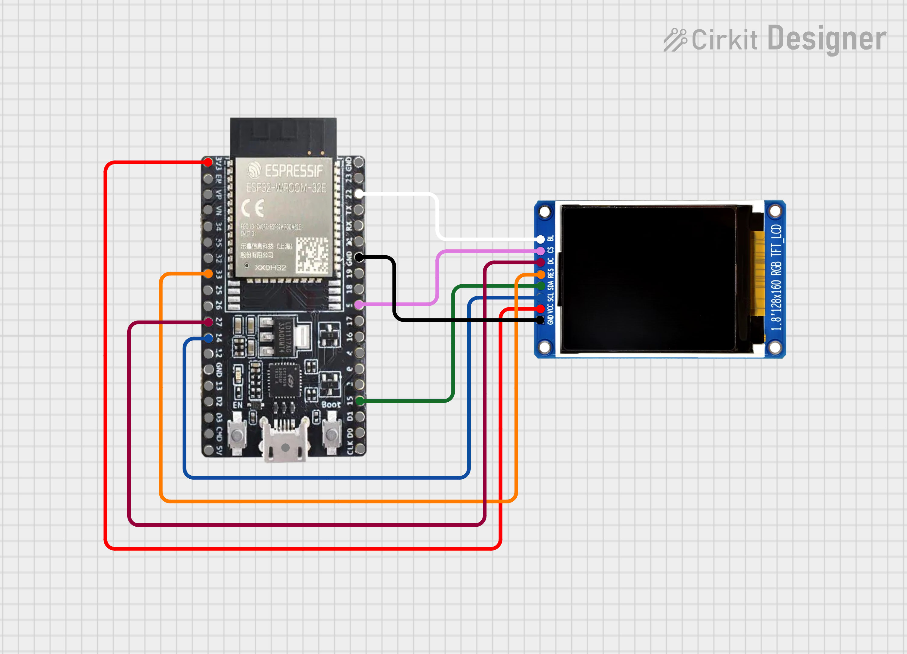

# ML Display

An ESP32+TFT display with 2 screen:
- Main Screen: an NTP clock and WebAPI data including weather, TWSE stock, currency.
- Player Screen: connected to Foobar2000 running on Windows, and showing current playing song metadata, position, and synced lyrics.

DEMO: [https://youtu.be/tnHw0xSMCKo](https://youtu.be/tnHw0xSMCKo)

## Installation

1. Circuit

    - ESP32-WROOM-32E 16MB + ST7735S 160x128

    

1. Create ```secrets.h``` in ```include``` folder

    ```c
    #define WEATHER_API_KEY "weatherapi.com key"
    #define CURRENCY_API_KEY "app.currencyapi.com key"
    ```

1. Create ```wifi_info.h``` in ```include``` folder

    ```c
    #define WIFI_SSID "SSID"
    #define WIFI_PASSWORD "PASSWORD"
    ```

1. Set upload settings

    - Board: ESP32 Dev Module
    - Partition Scheme: Custom(partitions.csv)
    - Flash Size: 16MB
    - Upload Speed: 921600

1. Build & upload to ESP32
